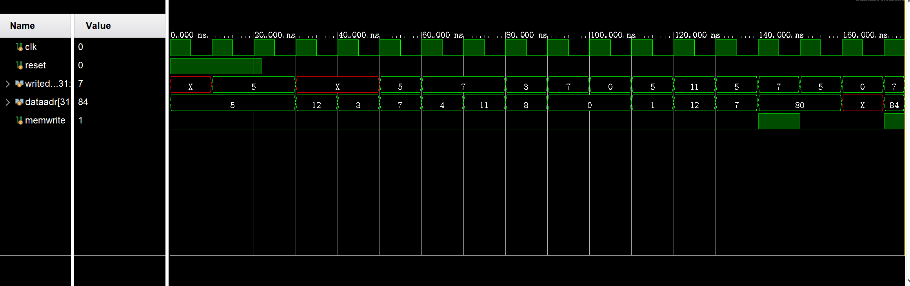
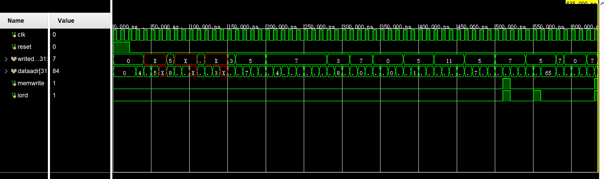
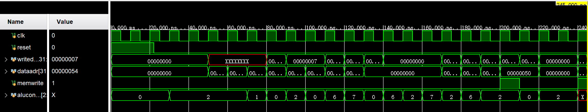

# This is solution to labs of COMP130191.03!
Progress: Completed pipeline design.

# Disclaimer
Since I have limited knowledge of Computer Architecture, there may be bugs in my solution.
So you'd better check yourself(The only guarantee is that **the program can be run on Vivido or QtSpim**)!  
Also, **do not copy codes directly from this repository**! These codes will just be helpful when you get stuck and want to
get some idea.

# Lab 1
*Reading the fucking manual* will be of great help.

# Lab 2

## Adding ori
First we have to add it to decoding truth table(`lab2/Dec_tt.csv`) and ALU truth table(`lab2/ALU_tt.csv`).
Solution: observe that each R-type operator has its I-type one, for simplicity, just use 'func' field to 
tell them apart.  
Workflow: `aludec.sv` $\rightarrow$ `controller.sv`.
## Adding bne
Add a new field `branchsrc` to controller will work. Truth tables are updated.

# Lab 3

Done. Think about how you can leverage figure `7-42` on page `254` to make this task easier.

# Pipeline

**NOTE**: This lab is called off😇 I sincerely hope you're happy with that😇😇😇  
If interested, you may look at comments in `pipeline/HazardUnit.sv` and `pipeline/datapath.sv` for some hints. They are largely the pitfalls I've met...

# IO Design
## Resources
Documentation to `NEXYS A7` DDR board can be found [here](https://digilent.com/reference/programmable-logic/nexys-a7/reference-manual#seven-segment_display).

## Pitfalls
<ol>
  <li>Make sure that you are lightening one digit of the 8 <b>one by one</b>.</li>
  <li>Both the AN0..7 and the CA..G/DP signals are driven <b>low</b> when active.</li>
  <li>The lightening frequency should be much smaller than 100MHZ(say, 1KHZ). Otherwise you may find the digits overlapped 
  with each other. This can be done by using a frequency divisor module.
  </li>
</ol>

# Appendix
Standard Testing File looks like this(you can also find it on page 278):
```
20020005
2003000c
2067fff7
00e22025
00642824
00a42820
10a7000a
0064202a
10800001
20050000
00e2202a
00853820
00e23822
ac670044
8c020050
08000011
20020001
ac020054
```
Also, you may want to test your hardware after adding `ori`, `andi`, `bne`, here is the test program:
```
20020005
34440007
30450004
14a00001
20040001
ac040054
```

To test your IO implementation, you should use this `memfile.dat`:
```
20100000
ac100080
8c110080
32320002
1240fffd
8c130088
8c14008c
0293a820
8c110080
32320001
1240fffd
ac150084
08000002
```
